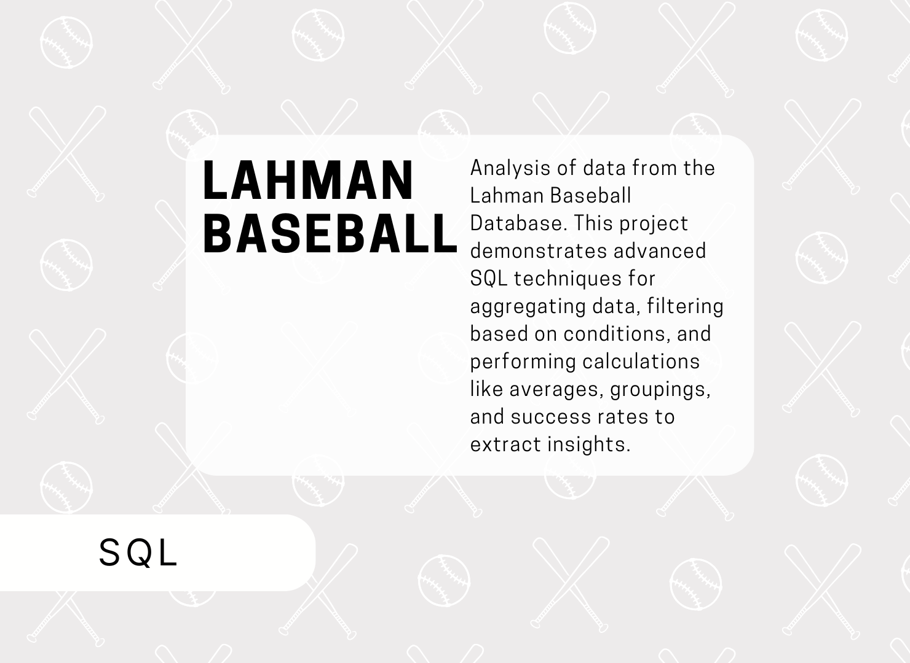

# Lahman Baseball Project (SQL)

  

The Lahman Baseball Database Exercise involved using SQL to explore a variety of baseball-related queries from the provided dataset. Skills demonstrated include complex joins, aggregations, and conditional logic to extract meaningful insights. 

# Key SQL tasks completed:
  * **Date Range**: Retrieved the range of years covered by the database.
  * **Player Data**: Identified the shortest player, listing their name, team, and games played.
  * **Vanderbilt Players**: Compiled a list of Vanderbilt University players and their total MLB earnings, sorted by salary.
  * **Player Positions**: Grouped players into fielding positions and calculated total putouts by each group.
  * **Strikeouts and Home Runs**: Calculated average strikeouts and home runs per game by decade.
  * **Stealing Success**: Found the player with the highest success rate in stolen bases (2016).
  * **Wins and World Series**: Analyzed wins and World Series victories from 1970–2016, examining the relationship between win counts and championship success.
  * **Attendance**: Identified parks with the highest and lowest average attendance in 2016.
  * **Manager Awards**: Found managers who won "TSN Manager of the Year" in both the National and American Leagues.
  * **Home Run Records**: Listed players who hit their career-high home runs in 2016.

This project highlighted SQL proficiency, particularly in querying, data filtering, and statistical analysis within sports datasets.
